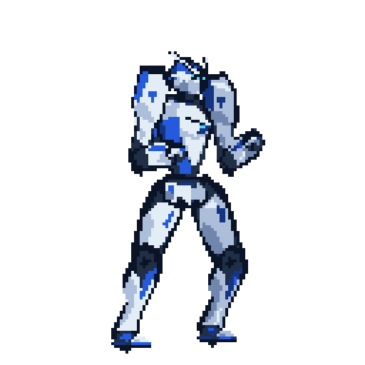

# Unnamed Fighting Game

A Godot 2D fighting prototype with a white-and-cobalt Soldier on a pixel-art scrapyard stage.

## Controls

- **A / D** or **Left / Right**: move.
- **Space / W / Up**: jump; release early for a shorter jump.
- **J**: punch on the ground or in the air; press again to queue one follow-up.
- **R**: reset.
