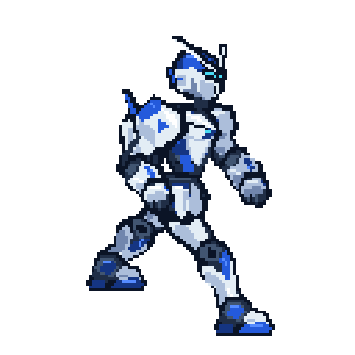
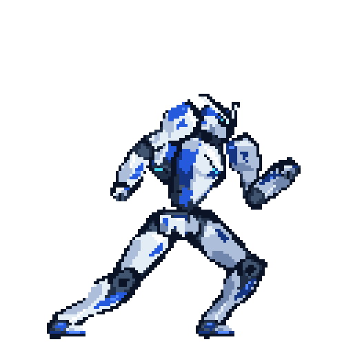

# Unnamed Fighting Game

A C# Godot 2D movement prototype with a white-and-cobalt Soldier and one line platform.

## Play

Use **Godot 4.7.2 .NET** and the **.NET 8 SDK**. Import `game/project.godot`, build, then press **F5**.

- **A / D** or **Left / Right**: move.
- **Space / W / Up**: jump; release early for a shorter jump.
- **R**: reset. Falling below the arena also resets the character.

## Art and animation

The [design guide](game_script/CHARACTER_DESIGN.md) and [workflow](game_script/REWORK_WORKFLOW.md) preserve the supplied references, Armored Core 6 and Gundam influences, and Brawlhalla-style gameplay scale.

All replacement art was drawn with code on integer pixel grids. Sixteen editable parts share a 12-color palette. The 128-by-128 animation canvas contains **28 discrete frames**: eight idle, eight walk and twelve jump-sequence poses. A C# clock advances all part layers together; weapon sockets follow per-frame hand coordinates. Raster pixels are never rotated or interpolated.

The [idle rework](game_script/IDLE_REWORK.md) follows the supplied stance GIF's skeleton and eight-pose, 600 ms loop. The [walk rework](game_script/WALK_REWORK.md) replaces the movement clip with eight poses from `soldier_walk.gif`, using the idle's limb lengths and armor dimensions. Each walk pose lasts 140 ms at normal speed. [Compare the walk poses](art/previews/walk-comparison.png).

| Location | Purpose |
| --- | --- |
| `art/parts/*.pixel.json` | Editable individual parts |
| `art/soldier.pixel.json` | Editable assembled animation with separate layers |
| `art/draw/`, `tools/PixelAuthor/` | Initial drawing definitions and C# tools |
| `art/exports/` | Code as Pixel Art exports |
| `art/previews/` | Enlarged previews and animated GIFs |
| `art/pixelloid/` | Pixelloid-processed outputs |
| `game/assets/soldier_frames/` | Verified sheets used by Godot |




The [twelve-pose jump](game_script/JUMP_REWORK.md) includes preparation, push-off, takeoff, ascent, apex, descent, landing and recovery. Physics supplies the jump height; the sprite frames retain the existing body-part sizes. [Compare all twelve poses](art/previews/jump-comparison.png).



**Pixelloid 0.1.3 processes exported PNGs before Godot integration.** Pixel size 1 preserves the already-authored pixels. [The report](art/PIXELLOID_REPORT.json) records the engine revision, settings and before/after RGBA hashes. Godot uses lossless imports, nearest filtering and disabled alpha-border modification.

## Authoring

Install Code as Pixel Art using `npx code-as-pixel-art install`. Set `PIX_CLI` to its CLI `dist/bin.js` if outside `.codex/tools/code-as-pixel-art`. Pixelloid processing needs a source checkout with npm dependencies installed; set `PIXELLOID_SOURCE` if outside `.codex/tools/pixelloid`. The report records the validated revision.

Run from the repository root:

```sh
dotnet build tools/PixelAuthor
dotnet run --project tools/PixelAuthor -- part head
dotnet run --project tools/PixelAuthor -- animate
dotnet run --project tools/PixelAuthor -- idle
dotnet run --project tools/PixelAuthor -- walk
dotnet run --project tools/PixelAuthor -- jump
dotnet run --project tools/PixelAuthor -- pixelloid
dotnet run --project tools/PixelAuthor -- verify-jump
```

Part construction refuses to overwrite an existing authored part. Regenerating animation from drawing definitions does not propagate later manual edits to part pixel documents. Preserve those edits and apply them explicitly to the assembled source before exporting. Keep `.pixel.json` as the editable source of truth. Revalidate through Pixelloid before copying updated layer sheets into Godot. Commit each body part and each medium milestone.

## Verification

With the .NET Godot executable available as `godot`:

```sh
dotnet build "game/Unnamed Fighting Game.csproj"
godot --headless --path game --editor --import
godot --headless --path game res://tests/movement_smoke.tscn
```

Latest result: **138 checks, zero failures**, covering all twelve poses during a full jump, grounded preparation, short jumps, landing recovery, jump buffering, coyote time, movement, frame synchronization and exact imported pixel hashes. The separate `verify-jump` check compares all 256 idle/walk part frames against commit `440d39c`, preserves their source timing and socket positions, and checks fixed jump segment lengths and canvas bounds. See [verification notes](game_script/REWORK_VERIFICATION.md).

Create `artifacts/` to capture a pose:

```sh
godot --path game -- --capture ../artifacts/run.png --pose run --frame 2
```

Combat remains design work: one loadout element, temporary status effects, and EM Frenzy built through hits and faster through combos.
