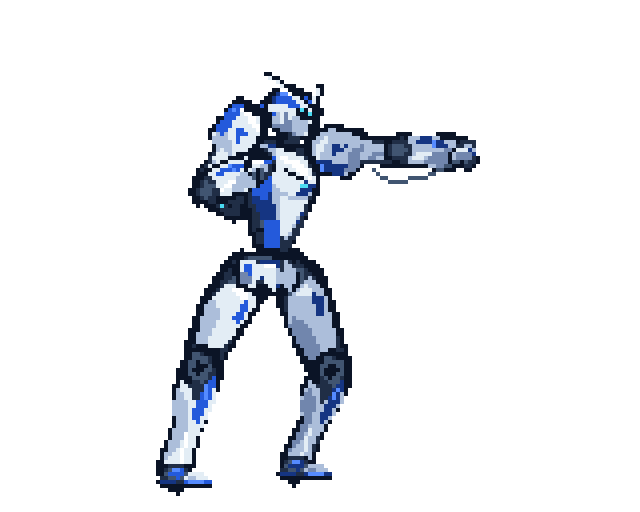
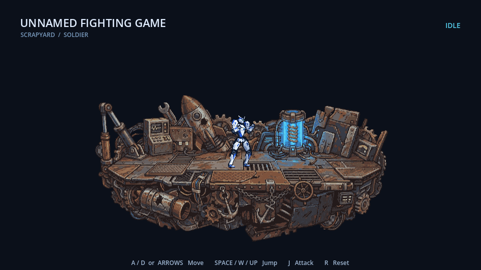

Previous implementation notes and authoring commands. Current behavior: [Mobile attack rework](MOBILE_ATTACK_REWORK.md).

# Unnamed Fighting Game

A C# Godot 2D fighting prototype with a white-and-cobalt Soldier and a scrapyard platform made from `stage_1.jpg`.

## Play

Use **Godot 4.7.2 .NET** and the **.NET 8 SDK**. Import `game/project.godot`, build, then press **F5**.

- **A / D** or **Left / Right**: move.
- **Space / W / Up**: jump; release early for a shorter jump.
- **J**: grounded jab with a fist smear and impact rings. One attack per press; jumping cancels it.
- **R**: reset. Falling below the arena also resets the character.

## Art and animation

The [design guide](CHARACTER_DESIGN.md) and [workflow](REWORK_WORKFLOW.md) preserve the supplied references, Armored Core 6 and Gundam influences, and Brawlhalla-style gameplay scale.

Soldier art was drawn with code on integer pixel grids. Sixteen editable parts share a 12-color palette. The 128-by-128 body canvas contains **29 discrete frames**: eight idle, eight walk, eight jump-sequence poses and five jab poses. A separate 160-by-128 effect canvas provides room for the impact rings. A C# clock advances all part layers and effects together; weapon sockets follow per-frame hand coordinates. Raster pixels are never rotated or interpolated.

The [idle rework](IDLE_REWORK.md) follows the supplied stance GIF's skeleton and eight-pose, 600 ms loop. The [walk rework](WALK_REWORK.md) replaces the movement clip with eight poses from `soldier_walk.gif`, using the idle's limb lengths and armor dimensions. Each walk pose lasts 140 ms at normal speed. [Compare the walk poses](../art/previews/walk-comparison.png).

| Location | Purpose |
| --- | --- |
| `art/parts/*.pixel.json` | Editable individual parts |
| `art/soldier.pixel.json` | Editable assembled animation with separate layers |
| `art/fight-effects.pixel.json` | Editable jab smear and impact rings |
| `art/stages/stage_1.pixel.json` | Editable full-resolution stage pixels |
| `art/stages/stage_1.pixelized.pixel.json` | Current 300×150 pixelized stage source |
| `art/stages/stage_1.layout.json` | Shared artwork placement, deck trace and spawn |
| `art/draw/`, `tools/PixelAuthor/` | Initial drawing definitions and C# tools |
| `art/exports/` | Code as Pixel Art exports |
| `art/previews/` | Enlarged previews and animated GIFs |
| `art/pixelloid/` | Pixelloid-processed outputs |
| `game/assets/soldier_frames/` | Verified sheets used by Godot |
| `game/assets/soldier_effects/` | Verified attack effect sheet |
| `game/assets/stage/` | Verified stage PNG and collision layout |


The [eight-pose jump](JUMP_8_REWORK.md) follows `soldier_jump_2.png`: preparation, push-off, ascent 1, ascent 2, apex, descent 1, descent 2 and landing. Physics supplies the jump height; the sprite frames retain the existing body-part sizes. [Compare all eight poses](../art/previews/jump-comparison.png).


The [jab workflow](FIGHT_REWORK.md) follows all five attack poses in `soldier_fight.gif`, including its 50/100/50/50/50 ms timing and four white impact stages. The reference is retargeted to the existing armor and fixed limb lengths; the boots remain planted. Holding J does not repeat the attack.



**Pixelloid 0.1.3 processes exported PNGs before Godot integration.** Pixel size 1 preserves the already-authored pixels. [The report](../art/PIXELLOID_REPORT.json) records the engine revision, settings and before/after RGBA hashes. Godot uses lossless imports, nearest filtering and disabled alpha-border modification.

## Authoring

### Main stage

Only **`stage_1.jpg`** supplies the map. The transparent master is preserved, padded to 900×450 and processed by actual Pixelloid medoid sampling at pixel size 3. The resulting editable **300×150** source is exported at exactly 2×, giving a smaller **600×300 stage with visible 2×2 pixels**. Lossless import, nearest filtering and integer viewport scaling keep the blocks sharp. [Pixelization settings and hashes](../art/stages/STAGE_1_PIXELIZATION.json).

The walking surface is one invisible horizontal line across the widest deck section, from **x=214 to x=762 at y=334**. Props and hanging machinery remain decorative. Artwork and collision share one layout file; normal character-collider overlap determines the last supported position at a ledge. Character size, controls, physics and animations are unchanged. [Current stage workflow](STAGE_1_PIXEL_REWORK.md) · [Pixel verification](../art/stages/STAGE_1_VERIFICATION.json).



### Commands

Install Code as Pixel Art using `npx code-as-pixel-art install`. Set `PIX_CLI` to its CLI `dist/bin.js` if outside `.codex/tools/code-as-pixel-art`. Pixelloid processing needs a source checkout with npm dependencies installed; set `PIXELLOID_SOURCE` if outside `.codex/tools/pixelloid`. The report records the validated revision.

Run from the repository root:

```sh
dotnet build tools/PixelAuthor
dotnet run --project tools/PixelAuthor -- part head
dotnet run --project tools/PixelAuthor -- animate
dotnet run --project tools/PixelAuthor -- idle
dotnet run --project tools/PixelAuthor -- walk
dotnet run --project tools/PixelAuthor -- jump
dotnet run --project tools/PixelAuthor -- fight
dotnet run --project tools/PixelAuthor -- stage
dotnet run --project tools/PixelAuthor -- pixelloid
dotnet run --project tools/PixelAuthor -- verify-fight
dotnet run --project tools/PixelAuthor -- verify-stage
```

Part construction refuses to overwrite an existing authored part. Regenerating animation from drawing definitions does not propagate later manual edits to part pixel documents. Preserve those edits and apply them explicitly to the assembled source before exporting. Keep `.pixel.json` as the editable source of truth. Revalidate through Pixelloid before copying updated layer sheets into Godot. Commit each body part and each medium milestone.

## Verification

With the .NET Godot executable available as `godot`:

```sh
dotnet build "game/Unnamed Fighting Game.csproj"
godot --headless --path game --editor --import
godot --headless --path game res://tests/movement_smoke.tscn
```

Latest result: **188 checks, zero failures**, covering uniform 2×2 stage pixels, flat support across the full deck, both ledges, falling and respawn, plus existing attack, animation and movement checks. `verify-stage` checks actual Pixelloid reduction, exact nearest-neighbor export, matching export/Pixelloid/game pixels and unchanged Soldier assets/controller. See [verification notes](REWORK_VERIFICATION.md).

Create `artifacts/` to capture a pose:

```sh
godot --path game -- --capture ../artifacts/run.png --pose run --frame 2
```

Combat remains design work: one loadout element, temporary status effects, and EM Frenzy built through hits and faster through combos.
